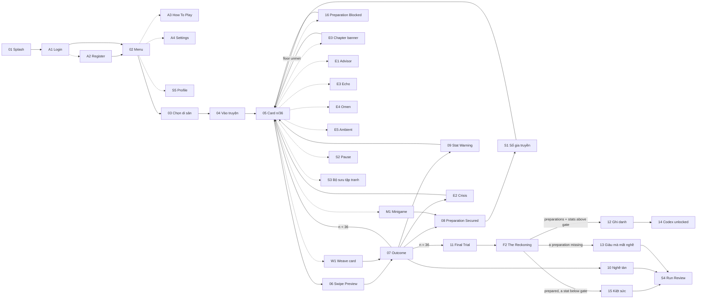

# User journey — one complete run

The full path a player takes, from launching the app to an ending. Every state below maps to a
screen. The run is one continuous game, 1938 → 9 Dec 2025, in three chapters
(`../content/dongho/level-map.md`).

---

## The journey

Left to right. Solid = the required path; dashed = reachable but optional. The 36-card loop sits in
the middle and everything else feeds into or out of it.



**Reading the loop.** `05 → 06 → 07` is one card played. From `07` the run either takes another card,
banks a preparation, trips a warning, trips a **crisis** (the one way back from a stat limit), dies,
or — on card 36 — goes to the trial. `E1 · E3 · E4 · E5` are interstitials: they cost no turn and
change no stat except `E5`, which gives a little back. `E0` fires twice, at the era turns.

Three additions keep the run fair without softening it:

| Addition | What it fixes |
| --- | --- |
| **`⚑` Sổ gia truyền** (preparation ledger) | The win condition would otherwise be unknowable. Now it is discoverable — see below. |
| **`⚡` Crisis** | Reaching a stat limit would be instant death. Now it costs a rescue; the *second* time is death. Two mistakes, not one. |
| **Advisor · Omen · Echo · Chapter** | Every beat would be a decision. Now the run breathes, and the big sacrifices are made informed. |

---

## The preparations, made playable

Victory needs the knowledge chain, an heir, the dossier, either road for the woodblocks, and two of
three transmission ticks. That rule is **not announced at the briefing** — stating it upfront would
turn the run into a checklist and forfeit the very thing `BRIEF-09` §1 rewards. Instead it is
*revealed by being used*:

```
  cards 1–6           ⚑ no ledger. The player is just keeping a workshop.
       │
  card 7   làng cháy  ADVISOR: "Ván nặng thì gạo nhẹ. Chọn lấy một gánh."
       │              → choose → PREPARATION SECURED
       ▼
  ⚑ LEDGER UNLOCKS    the slots appear, one filled:
       │                 ▣ Ván khắc — giữ hoặc chuộc  kháng chiến  ✓ secured
       │                 ▢ ————————————                still ahead
       │                 ▢ ————————————                still ahead
       │                 ⋮ Truyền thừa  ◇◇◇            0 of 3
       │              "Cơ hội còn ở phía trước. Nghề sẽ chỉ lúc, không chỉ đường."
       │
  cards 8–36          ⚑ reachable any time from the card screen
       ▼
  FINAL TRIAL         the ledger the player has been watching is the thing being checked
```

Two rules govern the ledger, both machine-enforced in `../tools/validate_data.py`:

- **`ledger.slots` must equal `finalTrial.requireAll`.** The player can never be shown a goal that is
  not the goal. The linter errors if they drift apart.
- **`hintPolicy: "when-not-what"`.** An empty slot may say a chance is still coming; it may never
  name the card or the choice. Discovering *that* a preparation matters is the lesson — being told
  which button to press is not.

The paired woodblock slot (`requireAny`) displays as **one** slot that either road can fill, and the
counter shows as a three-notch meter beside the slots. Optional preparations (`giu_mau_co`,
`mo_cua`) show as bonus slots: never gating, always rewarded.

### Each slot also carries a floor

A preparation costs stats — and it also **requires** some. Each carrier declares a `statFloor` that
must hold *entering* the card, or the preparation does not land: **the cost is paid and the flag is
not granted.**

| Slot | Floor | The household cannot, because |
| --- | --- | --- |
| Ván khắc (giữ) | `Người ≥ 20` | Blocks are heavy; without hands they burn with the house |
| Bí quyết | `Nghề ≥ 25` | You cannot teach a recipe you no longer hold |
| Ván khắc (chuộc) | `Sinh kế ≥ 20` | You cannot buy back with nothing |
| Truyền nhân | `Người ≥ 20` | A lineage of one has no one to receive |
| Hồ sơ | `Tiếng ≥ 25` | A craft nobody has heard of persuades nobody |

Three consequences for the screens:

- **The ledger shows the floor, never the choice.** A revealed slot reads `Người ≥ 20` beside its
  name. That stays inside `when-not-what` — a floor is a fact about the household's capacity, not a
  hint about which way to swipe.
- **The HUD must make a stat approaching a floor legible**, the same way it bands a stat approaching
  a crisis. Being blocked is recoverable; being blocked *without having seen it coming* is not.
- **A blocked preparation needs its own screen state** — not the ordinary outcome card. The player
  swiped, paid, and got nothing, and the text has to carry why: the failing stat boxed in red, the
  arithmetic stated plainly (*cần ≥ 20, hiện 14, thiếu 6*) above what was paid anyway.

Fairness rests on the advisors. Every floored required carrier has an advisor interstitial before it
(cards 7, 9, 23, 30, 31) and the linter errors if one is missing. On **Khó** advisors are suppressed
and the ledger stays shut until the trial — so there the floors are genuinely undisclosed, which is
the setting's whole premise and not an oversight.

---

## The four endings

A run can end four ways, and they teach different things. All four must exist, and **each one is a
real fate some household had.**

| Ending | Trigger | What it teaches |
| --- | --- | --- |
| **Ghi danh** *Victory* | reached the trial + every preparation + every stat above its gate | You won without being rich. |
| **Giàu mà mất nghề** *Defeat despite strength* | reached the trial, a preparation missing | A profitable workshop is not a living craft. |
| **Kiệt sức** *Spent* | reached the trial **with every preparation**, a stat below its gate | You prepared everything correctly and had nothing left to do it with. |
| **Nghề tàn** *The craft ends* | a stat hit `0` or `100` **after its crisis was already spent** | The household destroyed itself before the judgment came. |

**Kiệt sức** is the sharpest. Holding every preparation while every stat sits under 10 is a household
that did every historically correct thing and then collapsed before it could use any of it — and
letting that count as a win would say preparation is a checklist rather than something a living
practice has to *sustain*. It is also the fate of most of the seventeen lineages, which is exactly
the part a certificate does not record.

**Nghề tàn** is the one teams usually forget, and it is where the two-sided stat model pays off —
hitting `100` on `tieng` (fame without the hand behind it) is a *different* ending from hitting `0`,
with a different explanation.

Note the trigger: not "a stat hit its limit" but "a stat hit its limit *twice*" — once to burn the
crisis, once to die. **Victory is the expected outcome of attentive play**, and the defeats are what
a careless or a money-first run earns. That is the right way round: the run's argument is that the
historical path *works*, and a level nobody finishes cannot make that argument.

---

## What changes when you play again

The journey above is the *shape* of every run. It is not the same run twice.

**What never changes — the spine.** The 36 dated cards, in one order, every time. The market cannot
die before the war reaches the village, and the dossier cannot be filed after its deadline. That is
not a limitation to work around; it is the run's argument, and it is enforced in
`../tools/validate_data.py`.

**What is drawn fresh — the weave.** Four undated decisions per run, dealt by chapter from a pool of
seventeen: a wedding orders prints and asks what the rat wedding means; a daughter asks to stand at
the block; the guild borrows a woodblock; a reporter wants a day in the workshop. Plus up to three
ambient beats from a pool of eight.

**What the player causes.** Crises are not drawn at all — they fire when a stat crosses `≤20` or
`≥80`, so a careful run may never see one and a reckless run sees three. Echo interstitials fire only
if the choice that triggers them was taken.

**What it must never do** — and this is the whole reason it is safe: no draw may change whether the
run can be won. The harshest legal deal, played well, cannot cost the player a preparation they
needed. `weavePolicy.maxWorstCaseSwing` states the bound and the linter proves it on every run.

**In the UI this must be legible, not hidden.** A dated spine card carries its year in the header; a
weave card carries no year at all. That difference is doing real work — it is the game telling the
player, without a word of explanation, which of these things the record actually recorded. It is also
the honest answer to a marker asking which content is documented and which is composed.

### Difficulty — what the A4 control actually does

Declared in `../content/game.json` and enforced by the linter. It changes **how much the game tells
you and how much slack it leaves. It never changes a number, a cost, or the win rule** — so a Khó
victory and a Dễ victory mean the same thing, and the leaderboard stays comparable.

| Dial | **Dễ** | **Thường** | **Khó** | **Cực khó** |
| --- | --- | --- | --- | --- |
| Crisis warning band | `≤30 / ≥70` | `≤20 / ≥80` | **none** | **none** |
| Sổ gia truyền (S1) — **scope** | one big ledger, all chapters, open anytime | three per-chapter ledgers | three per-chapter ledgers | **no ledger at all** |
| Advisor interstitials | shown | shown | **suppressed** | **suppressed** |
| Ambient beats per run | 3 | 3 | 1 | 1 |
| Omen interstitials | shown | shown | shown | shown |
| Minigame hints | labels on every tile | labels shown once, then hidden | icons only, no reference image — **still retryable until complete** | icons only |
| Run review (S4) | full | full | full | full |

**Difficulty is re-selectable mid-playthrough** and applies immediately (an alert confirms the
switch, and it persists until changed again). Safe by construction — no dial touches a number, a
cost, a flag or the deal. Crisis bands are evaluated at each card's resolve against the *current*
difficulty; spent rescues are never refunded by a switch. The **leaderboard records the lowest
difficulty used** at any point in the playthrough.

Four of these are guarantees rather than dials, and the linter rejects any attempt to vary them.
**Omens** stay on because the households genuinely knew what was coming — the war reached the
district, offset calendars were already in the shops, the survey team was announced — so hiding it
would be a false claim about what was knowable, not a difficulty. **Run review** stays full because
it is where a defeat becomes a lesson; gating it would hand the teaching to exactly the players who
needed it least. **Minigame completion** is never gated by difficulty: if dexterity could
permanently fail a preparation, difficulty would be deciding outcomes, which it must never do.
**Reason chips** stay on at every difficulty — difficulty withholds foresight, never hindsight.

**Five dials, four surfaces.** The card screen HUD carries two of them (crisis banding and ambient
frequency); S1 the ledger carries disclosure timing; the interstitial run carries advisors present or
absent; the minigames carry the hint level. Nothing else changes, and nothing else should. All five
are declared in `difficultyPolicy.mayChange`, and the linter errors on any difficulty key that is not
on that list — so a dial that is not declared cannot be built.

---

## Side flows

Five flows branch off the main line. None is decoration — each is either a marked requirement or the
thing that makes the main line survivable.

```
              CARD SCREEN  (the hub — every side flow is one tap from here)
                   │
   ⚑ ledger ───────┤───────── ⏸ pause ─────────┬───── 🖼 codex
                   │                            │
                   └──── after any ending ──────┴───── ↺ run review ──── 🏆 profile
```

| # | Side flow | Reached from | What it is | Why it earns its build cost |
| --- | --- | --- | --- | --- |
| **S1** | **⚑ Sổ gia truyền** *Preparation ledger* | card screen, after first preparation | The preparations, filled/open/missed, with floors and `when-not-what` hints | The single feature that makes victory reachable. Without it the win rule is unknowable until it is too late. |
| **S2** | **⏸ Tạm dừng & tiếp tục** *Pause / resume* | card screen | Pause overlay → save & quit; resumes on the exact card with stats, flags, ticks and spent crises intact. Continuity is **per chapter**: each chapter entry writes a checkpoint, Restart reloads it with a fresh seed, and restarting an earlier chapter locks all later ones | `BRIEF-05` §6 lists save-and-resume surviving a full app kill as an advanced feature — `DEC-01` D10, worth marks. The chapter structure gives the save its natural boundaries, and a chapter is a comfortable single sitting. |
| **S3** | **🖼 Bộ sưu tập tranh** *Codex* | card screen · menu | Every painting and craft fact the player has unlocked, searchable and filterable by chapter, year and `historicity` bucket | Carries four requirements at once: search/filter (`BRIEF-05`), CRUD over a real collection (`BRIEF-03`), Report §2 evidence, and it is `mg_match`'s content source. |
| **S4** | **↺ Xem lại ván** *Run review* | any ending | The full decision log — spine, drawn cards and crises, with each choice's stat deltas and reason chips, and where each preparation was won or lost | Turns a defeat into a lesson instead of a wall. It is also the screen that proves to a marker that the outcome was *earned*, not random. |
| **S5** | **🏆 Hồ sơ & xếp hạng** *Profile + leaderboard* | victory · menu | Best run, endings collected, preparations found, paintings collected, badges; leaderboard entry written on victory | `BRIEF-04` requires a leaderboard view with badges and interactive charts, and `BRIEF-03` requires profiles — victory is the natural moment to write to both. |

**S3 is the one worth over-building.** It is the only screen where the project's actual research
becomes a *feature* rather than a footnote, and it satisfies search/filter and CRUD in a way that is
native to the game instead of bolted on. A codex that fills as the player plays is also the cleanest
answer to "where is the cultural content?" — it is the reward, not the wrapper.

---

## Screen set

The screens the build needs, by function. Visual design is a live task on the board; this list is the
contract the design must satisfy.

**Access — 4.** Login · Register · How To Play · Game Settings (`BRIEF-03` registration/login/logout;
`BRIEF-04` §3 and §5 required views).

**Main line — 16.** Splash · Menu · Chọn di sản · **Chapters** (the three era chapters: locked /
resumable / restartable, persisted stats shown) · Vào truyện (opening briefing) · Card · Swipe
preview (mid-drag) · Outcome · Preparation Secured · Preparation Blocked · Stat Warning · **Chapter
Summary** (per-chapter lesson: how the chapter went, the era's real record, the stats carried
forward — chapters I and II; chapter III flows into the trial) · Final Trial · The Reckoning · the
four endings share one templated result screen with four states · Codex unlocked.

**Restart flows.** Home-screen "Restart" opens a two-option popup — *chapter-restart* or
*restart-all*. Chapter-restart of an earlier chapter warns explicitly that every later chapter will
lock (their entry states are no longer true) before proceeding; the Chapters screen offers
per-chapter restart directly with the same warning.

**Interstitials — 6.** Chapter banner · Advisor · Omen · Echo · Ambient · Crisis.

**Minigames — 2.** Nối tranh–nghĩa (4↔4 match) · Ghép ván in (3×3 rotate).

**Side flows — 5.** Ledger · Pause/Resume · Codex · Run Review · Profile & Leaderboard.

**Cloud sync** has no screen of its own — it is a behaviour of the profile, the run save (S2) and the
leaderboard (S5). It is required by `BRIEF-03` and blocked on `DEC-01` **D7**; when D7 closes, record
here which of those three write to the cloud, which stay local, and what happens offline.

---

## House canon — the rules every screen must obey

| Rule | Canon |
| --- | --- |
| **Stat names** | `NGHỀ` · `SINH KẾ` · `TIẾNG` · `NGƯỜI`. No synonyms, ever. |
| **App name** | One name everywhere. `DEC-01` **D6 is open** — pick one, then sweep. |
| **Danger text** | One dedicated danger colour, used only for loss and danger. The deep structural colour is for borders, rules and filled buttons, never for warning text. |
| **Header** | Two patterns only. In-game: menu glyph · wordmark · codex glyph. Everywhere else: back chevron · centred small-caps title · optional right action. |
| **Navigation** | No bottom tab bar anywhere. The app is chevron-and-modal. |
| **Stat HUD** | Always shows the **numeric value**, not just icon and label. A player deciding blind is a design failure, not minimalism. |
| **Mid-drag preview** | While the card is held past the choice threshold, the HUD shows the **exact deltas** of the revealed choice ("▼ 15" in the danger colour for loss, "▲ 5" in the gain colour) and the affected stats' bars **dim to 50% opacity** so the incoming change is the loudest thing in the HUD. Unaffected stats stay at full opacity with no chip — the contrast itself says "these two move, those two don't". Releasing commits; dragging back to centre cancels. |
| **Year chip** | A dated spine card shows its year; a weave card shows "Không rõ năm". This is a truth claim, not decoration. |
| **Reason chips** | On the outcome screen every stat delta carries its `effectReasons` chip (≤ 8 từ) naming the in-world cause; the run review repeats them. Never on the mid-drag preview — the preview shows what you are trading, the outcome shows what it meant. Shown at every difficulty (`game.json` `neverChanges`). |
| **Preparation tracker** | One component at three sizes (inline on Preparation Secured, list at the trial, full on S1). Same glyphs, same order, same treatment for unearned slots. The paired woodblock slot is one slot; the counter is a three-notch meter. |
| **Era chapter screen** | Opens chapters II and III: era title · one line of bridge text · a snapshot of the ledger (per-chapter scope). It is a beat, not a decision — no swipe, one tap to enter the chapter. |
| **Game View animations** | Three distinct ones, named so the build cannot ship two and call it three (`BRIEF-04` §2 asks for a move/placement action, a scoring/feedback event, and a view transition): **(1) the card drag** — tilt, shadow lift and the mid-drag HUD preview above; **(2) the stat-bar resolve** — the four bars animate to their new values on release, the changed ones overshooting slightly and settling, with the crisis band flashing if one is entered; **(3) the card-to-card transition** — the resolved card flies off in the chosen direction while the next card rises from the deck, and the year chip cross-fades. The minigames' own animations are additional, not a substitute for these three. |
| **Audio** | Background music on Menu, How To Play and Leaderboard (`BRIEF-05` §2, mandatory); sound effects on swipe commit, preparation secured, preparation blocked, crisis entry and the trial verdict. One mute toggle in Game Settings, honoured everywhere. |
| **Splash** | `01 Splash` is **animated** (`BRIEF-05` §2): the black outline block prints last over the colours already laid down, which is the craft's actual order of work and the game's thesis in one gesture. |
| **Score** | Victory is boolean, so the leaderboard cannot rank by it. The ranked number is the **run score**, written once at any ending: `preparations held × 100 + truyền thừa ticks × 50 + ending tier (Ghi danh 300 · Giàu mà mất nghề 100 · Kiệt sức 100 · Nghề tàn 0)`, tie-broken by the *lowest* `sinh_ke` at the trial, and tagged with the **lowest difficulty used** during the playthrough — arriving poor and prepared is the better run, and the tiebreak has to say so or the game's whole argument leaks out through the leaderboard. The Game View shows the preparation tracker rather than a running number; the score is revealed at The Reckoning. |

---

## The demo run — the line to record

One concrete playthrough, `REPLAY`ed by `../tools/trace_run.py` against the card table, ending in
victory with **every** preparation. This is the run to record for the video: it takes all the
preparations, refuses both traps, plays both minigames, and finishes with a modest workshop.

It is **not** the `SEARCH` line quoted in `../content/dongho/level-map.md` — that one is the tool's
cheapest all-preparation solution and accepts one crisis; this one accepts both crises it is offered
and ends poorer. Both win. Quote the numbers from whichever run you are actually describing.

> ⚠️ **Pin the seed before recording.** Weave and ambient cards are drawn, so this table traces the
> **spine only** and a live run will have four extra decisions and up to three ambient beats woven
> through it. Ship a debug seed that fixes the draw, and use it for every take.

Start `nghe 60 · sinh_ke 50 · tieng 55 · nguoi 50`. Line:
`1A 2A 3B 4B 5A 6B 7A 8A 9A 10B 11B 12A 13A 14B 15A 16A 17A 18A 19A 20A 21B 22B 23A 24A 25A 26B 27A 28B 29A 30A 31A 32A 33B 34B 35A 36B`

| Card | nghe | sinh_ke | tieng | nguoi | ⚑ |
| --- | --- | --- | --- | --- | --- |
| 6 `toan-quoc-khang-chien` | 60 | 50 | 45 | 40 | *(nghe crisis fired and was taken here)* |
| **7 `lang-chay`** | 60 | 40 | 35 | 40 | 🏳 **giữ ván** |
| **9 `tan-cu-day-nghe`** | 65 | 35 | 45 | 45 | 🏳 **bí quyết** · minigame |
| 11 `lai-buon-do-co` | 65 | 25 | 45 | 45 | trap refused |
| **12 `ve-lang`** | 65 | 45 | 40 | 50 | ◇ tick 1 *(sinh kế crisis taken)* |
| **15 `day-con-trong-xuong`** | 70 | 50 | 40 | 50 | ◇ tick 2 |
| **18 `luu-mau-co`** | 70 | 60 | 40 | 50 | 🏳 mẫu cổ *(bonus)* |
| **20 `con-muon-o-lai`** | 70 | 60 | 40 | 50 | ◇ tick 3 |
| 22 `htx-giai-the` | 75 | 50 | 30 | 50 | trap refused |
| **23 `nhat-ve-tung-tam`** | 75 | 35 | 35 | 50 | 🏳 **chuộc ván** |
| **27 `mo-cua-don-khach`** | 60 | 55 | 40 | 55 | 🏳 mở cửa *(bonus)* · minigame |
| **30 `chau-noi-nghe`** | 60 | 55 | 40 | 70 | 🏳 **truyền nhân** · minigame |
| **31 `ho-so-khoi-dong`** | 55 | 45 | 45 | 70 | 🏳 **hồ sơ** |
| 36 `dem-truoc-new-delhi` | **50** | **65** | **60** | **70** | 7 preparations · 3 ticks |

Gates are `15 / 10 / 10 / 15`, so the run clears by `35 / 55 / 50 / 55` — comfortably, and with a
workshop that never got rich. Two crises fired and were accepted; **refusing the craft-side offer
instead ends the same line at `70 / 65 / 65 / 70`** — both win, which is the point of a crisis being
a choice rather than a cutscene.

The same completeness is reachable on **Khó**, where no crisis exists at all, ending
`60 / 55 / 60 / 60`. Re-run `python3 tools/trace_run.py` after any number change: it re-proves both.
