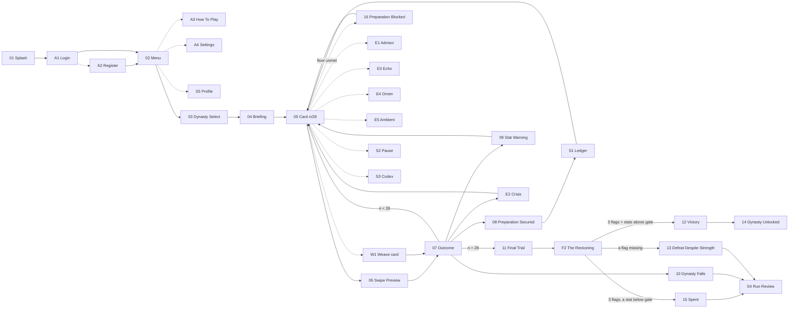

# User journey — one complete level

The full path a player takes through Level 1 (Trần), from launching the app to an ending. Every state
below maps to a screen; the table at the bottom tracks which exist in Stitch.

---

## The journey

Left to right. Solid = the required path; dashed = reachable but optional. The 28-card loop sits in
the middle and everything else feeds into or out of it.



**Reading the loop.** `05 → 06 → 07` is one card played. From `07` the run either takes another card,
banks a preparation, trips a warning, trips a **crisis** (the one way back from a stat limit), dies,
or — on card 28 — goes to the trial. `E1 · E3 · E4 · E5` are interstitials: they cost no turn and
change no stat except `E5`, which gives a little back.

**What changed and why.** The loop above used to be *card → outcome → maybe die*. A stat touching
its limit ended the run instantly, and the three conditions that actually decide victory were
invisible until the final trial — so a first-time player could do everything the level was asking
and still be ambushed at the end. Three additions fix that without softening the design:

| Addition | Fixes |
| --- | --- |
| **`⚑` Preparation Ledger** | The win condition was unknowable. Now it is discoverable — see below. |
| **`⚡` Crisis** | Reaching a limit was instant death. Now it costs a rescue; the *second* time is death. Two mistakes, not one. |
| **Advisor · Omen · Echo** | Every beat was a decision. Now the level breathes, and the big sacrifices are made informed. |

---

## The three conditions, made playable

Victory needs `long_dan` + `tieu_tho` + `coc_bach_dang`. That rule is still **not announced at
briefing** — stating it upfront would turn the level into a checklist and forfeit the very thing
`BRIEF-09` §1 rewards. Instead it is *revealed by being used*:

```
  cards 1–12          ⚑ no ledger. The player is just governing.
       │
  card 13  Diên Hồng  ADVISOR: "Hỏi dân thì được lòng dân, nhưng triều thần sẽ hận ngươi."
       │              → choose → PREPARATION SECURED
       ▼
  ⚑ LEDGER UNLOCKS    three slots appear, one filled:
       │                 ▣ Lòng dân thống nhất   1284  ✓ secured
       │                 ▢ ————————————          still ahead
       │                 ▢ ————————————          still ahead
       │              "Cơ hội còn ở phía trước. Sử sẽ chỉ lúc, không chỉ đường."
       │
  cards 14–28         ⚑ reachable any time from the card screen
       │              fills at 16 (tiêu thổ) and 26 (cọc Bạch Đằng)
       ▼
  FINAL TRIAL         the ledger the player has been watching is the thing being checked
```

Two rules govern the ledger, both machine-enforced in `validate_data.py`:

- **`ledger.slots` must equal `finalTrial.requireAll`.** The player can never be shown a goal that is
  not the goal. The linter errors if they drift apart.
- **`hintPolicy: "when-not-what"`.** An empty slot may say a chance is still coming; it may never
  name the card or the choice. Discovering *that* preparation matters is the lesson — being told
  which button to press is not.

The optional fourth preparation (`hau_can_dich`, Vân Đồn 1287) shows in the ledger as a bonus slot.
It never gates victory; it exists so an attentive player is rewarded for noticing something the rule
does not require.

### Each slot also carries a floor

A preparation costs stats — and it also **requires** some. Each required carrier declares a
`statFloor` that must hold *entering* the card, or the preparation does not land: **the cost is paid
and the flag is not granted.**

| Slot | Floor | The court cannot, because |
| --- | --- | --- |
| Diên Hồng | `Lòng dân ≥ 20` | The elders will not come |
| Bỏ Thăng Long | `Lòng dân ≥ 25` | A starving city will not walk out and burn its own granary |
| Cọc Bạch Đằng | `Binh lực ≥ 25` | Stakes are wood with nobody on the banks |

Three consequences for the screens:

- **The ledger shows the floor, never the choice.** A revealed slot reads `Lòng dân ≥ 25` beside its
  name. That stays inside `when-not-what` — a floor is a fact about the court's capacity, not a hint
  about which way to swipe.
- **The HUD must make a stat approaching a floor legible**, the same way it bands a stat approaching
  a crisis. Being blocked is recoverable; being blocked *without having seen it coming* is not.
- **A blocked preparation needs its own screen state** — not the ordinary outcome card. The player
  swiped, paid, and got nothing, and the text has to carry why. Built as **16 · Preparation Blocked**
  (`2a7115a5`): the failing stat is boxed in red in the HUD, and the screen states the arithmetic
  plainly — *cần ≥ 25, hiện 18, thiếu 7* — above what was paid anyway.

Fairness rests on the advisors. Every floored carrier has an advisor interstitial before it (cards
13, 16, 26) and the linter errors if one is missing. On **Khó** advisors are suppressed and the
ledger stays shut until the trial — so there the floors are genuinely undisclosed, which is the
setting's whole premise and not an oversight.

---

## The four endings

A level can end four ways, and they teach different things. All four must exist.

| Ending | Trigger | What it teaches |
| --- | --- | --- |
| **Victory** | reached the trial + all 3 flags + every stat above its gate | You won without being stronger. |
| **Defeat despite strength** | reached the trial, a flag missing | Raw force is how this war is lost. |
| **Spent** ⭐ *new* | reached the trial **with all three flags**, a stat below its gate | You prepared everything correctly and had nothing left to do it with. |
| **Dynasty falls** | a stat hit `0` or `100` **after its crisis was already spent** | The court destroyed itself before the enemy arrived. |

**Spent** is the newest and the sharpest. Holding all three preparations while every stat sits under
10 is a court that did every historically correct thing and then collapsed before it could use any of
it — and letting that count as a win would say preparation is a checklist rather than something a
functioning state has to *execute*. Its text is written (`finalTrial.defeatByExhaustionText`) and it
is the only ending prose not still TODO:

> *"Cọc đã đóng. Kinh thành đã bỏ. Cả nước đã một lòng. Ba việc ấy làm xong cả, và đến ngày nước lên
> thì không còn ai đứng dậy được nữa… Nhà Trần đã chuẩn bị đúng tất cả những gì cần chuẩn bị, rồi
> kiệt sức trước khi kịp dùng đến."*

✅ **Built as `ba0e9ae7`.** It does not reuse Defeat Despite Strength — that screen says *you were
strong and unprepared*, this one says the opposite. It shows the ledger with all three slots
**filled and checked**, then the stat that gave out (`QUỐC KHỐ 6`, tối thiểu 10, KHÔNG ĐỦ) above the
three that held.

**Dynasty falls** is the one teams usually forget, and it is where the two-sided stat model pays off
— hitting `100` on `binh` (kiêu binh) or `than` (quyền thần) is a *different* ending from hitting
`0`, with a different historical explanation.

Note the trigger has changed. It is no longer "a stat hit its limit" but "a stat hit its limit
*twice*" — once to burn the crisis, once to die. **Victory is now the expected outcome of attentive
play**, and the two defeats are what a careless or a force-first run earns. That is the right way
round: the level's argument is that the historical path *works*, and a level nobody finishes cannot
make that argument.

---

## What changes when you play again

The journey above is the *shape* of every run. It is not the same run twice.

**What never changes — the spine.** The 28 dated cards, in one order, every time. Diên Hồng cannot
precede the invasion it answers, and the three preparations land on the same three cards in every
playthrough. That is not a limitation to work around; it is the level's argument, and it is enforced
in `../tools/validate_data.py`.

**What is drawn fresh — the weave.** Six undated court decisions per run, dealt into Acts II–IV from
a pool of twelve: a dyke gives way, a magistrate is accused, bondservants flee an estate, an old
general asks to go home. Plus five ambient beats from a pool of twelve. `C(6,3) × C(3,1) × C(3,2) ×
C(12,5)` ≈ **142,000 distinct event sets** around an identical spine.

**What the player causes.** Crises are not drawn at all — they fire when a stat crosses `≤20` or
`≥80`, so a careful run may never see one and a reckless run sees three. Echo interstitials fire only
if the choice that triggers them was taken.

**What it must never do** — and this is the whole reason it is safe: no draw may change whether the
level can be won. The harshest legal deal, played well, cannot cost the player a stat they needed.
`weavePolicy.maxWorstCaseSwing` states the bound and the linter proves it on every run. See
*Spine and weave* in `../content/tran/level-map.md`.

**In the UI this must be legible, not hidden.** A dated spine card carries its year in the header; a
weave card carries no year at all. That difference is doing real work — it is the game telling the
player, without a word of explanation, which of these things the record actually recorded. It is also
the honest answer to a marker asking which content is documented and which is composed.

### Difficulty — what the A4 control actually does

Declared in `../content/game.json` and enforced by the linter. It changes **how much the game tells
you and how much slack it leaves. It never changes a number, a cost, or the win rule** — so a Khó
victory and a Dễ victory mean the same thing, and the leaderboard stays comparable.

| Dial | **Dễ** | **Thường** | **Khó** *Without hindsight* |
| --- | --- | --- | --- |
| Crisis warning band | `≤30 / ≥70` | `≤20 / ≥80` | **none — no rescue at all** |
| Preparation ledger (S1) | open from card 1, slots named | opens after the first flag, `when-not-what` hints | **not until the final trial** |
| Advisor interstitials | shown | shown | **suppressed** |
| Ambient beats per run | 5 | 3 | 1 |
| Omen interstitials | shown | shown | shown |
| Run review (S4) | full | full | full |

Two of these are guarantees rather than dials, and the linter rejects any attempt to vary them.
**Omens** stay on because the historical court genuinely knew an invasion was coming — envoys, border
reports, tributary intelligence — so hiding it would be a false claim about what was knowable, not a
difficulty. **Run review** stays full because it is where a defeat becomes a lesson; gating it would
hand the teaching to exactly the players who needed it least.

Khó with no crisis bands is not a new design — it restores the original model exactly, where a stat
touching `0` or `100` ended the run on the spot. That version was too punishing as a default. As the
top difficulty it is the correct version of itself.

**Three screens change behaviour with this setting** — the card screen HUD (crisis banding), S1 the
ledger (disclosure timing), and the interstitial run (advisors present or absent). Nothing else does,
and nothing else should.

---

## Side flows

Five flows that branch off the main line. None of them is decoration — each one is either a marked
requirement or the thing that makes the main line survivable, and that is the argument for building
them rather than more card art.

```
              CARD SCREEN  (the hub — every side flow is one tap from here)
                   │
   ⚑ ledger ───────┤───────── ⏸ pause ─────────┬───── 📜 codex
                   │                            │
                   └──── after any ending ──────┴───── ↺ run review ──── 🏆 profile
```

| # | Side flow | Reached from | What it is | Why it earns its build cost |
| --- | --- | --- | --- | --- |
| **S1** | **⚑ Sổ chuẩn bị** *Preparation Ledger* | card screen, after first flag | The three conditions, filled/open/missed, with `when-not-what` hints | The single change that makes victory reachable. Without it the win rule is unknowable until it is too late. |
| **S2** | **⏸ Tạm dừng & tiếp tục** *Pause / resume* | card screen | Pause overlay → save & quit; resumes on the exact card with stats, flags and spent crises intact | `BRIEF-05` §6 lists save-and-resume surviving a full app kill as an advanced feature — `DEC-01` D10, worth marks. A 28-card level is too long for one sitting without it. |
| **S3** | **📜 Sử liệu** *Historical Codex* | card screen · menu | Every `historicalNote` the player has unlocked, searchable and filterable by year, dynasty and `historicity` bucket | Carries three requirements at once: search/filter (`BRIEF-05`), CRUD over a real collection (`BRIEF-03`), and it makes the game's research visible — which is exactly what Report §2 has to evidence. |
| **S4** | **↺ Xem lại ván** *Run review* | any ending | The 28-decision log: card, choice taken, stat deltas, where each flag was won or lost | Turns a defeat into a lesson instead of a wall. It is also the screen that proves to a marker that the outcome was *earned*, not random. |
| **S5** | **🏆 Hồ sơ & xếp hạng** *Profile + leaderboard* | victory · menu | Best run, endings collected, preparations found, badges; leaderboard entry written on victory | `BRIEF-04` requires a Leaderboard view with badges and interactive charts, and `BRIEF-03` requires profiles — victory is the natural moment to write to both. |

**S3 is the one worth over-building.** It is the only screen where the project's actual research
becomes a *feature* rather than a footnote, and it satisfies search/filter and CRUD in a way that is
native to the game instead of bolted on. A codex that fills as the player plays is also the cleanest
answer to "where is the cultural content?" — it is the reward, not the wrapper.

---

## Screen inventory

**43 screens built** in the Stitch project. That count includes a **13-screen card-taxonomy gallery**
(17 Aug 2026, for the team pitch — one archetype per card sub-type, per the team's taxonomy:
Decision {Spine[Normal{setup·pressure·relief·trap} · Carrier] · Weave · Crisis} ·
Non-decision {Ambient · Interstitial[advisor·omen·echo]} · Final trial):

| Type | Screen id | Visual signature |
| --- | --- | --- |
| Spine·Normal·setup | `63eeaf11` | year chip + solid gold frame; small stakes |
| Spine·Normal·pressure | `ed26947f` | same frame; tempts toward raw strength *(Stitch title still "Loại 1/8" — rename by hand)* |
| Spine·Normal·relief | `d72acf2b` | same frame; recovers a stat by paying another |
| Spine·Normal·**trap** | `3981a5cd` | **deliberately identical to an ordinary card** — no warning of any kind |
| Spine·Carrier | `3724f943` | double gold frame; requirement strip; "⬦ Giành được:" |
| Weave | `7199531b` | "Không rõ năm"; dashed bronze frame |
| Crisis | `1a3e8562` | red banner; "chỉ số của ngươi đã gọi lá này ra" |
| Ambient | `1c8426da` | no dark card; jade chips; one tap |
| Interstitial·advisor | `c420f889` | quote + coming cost; off on Khó *(title still "Loại 5/8" — rename)* |
| Interstitial·omen | `0402ab9d` | red-framed warning, one card ahead; never off |
| Interstitial·echo | `16354c00` | "VÌ NGƯƠI ĐÃ CHỌN" — the only one conditioned on the player |
| Final trial | `fa90100f` | the two-question stele; not swipeable |
| Flag (what the trial counts) | `de95a37d` | a seal, not a card |

⚠️ **Known duplicates to delete by hand in Stitch:** `56f521c5` (copy of F2), `9e633d42` (copy of
16), `8218c798` (copy of the Carrier archetype — keep `3724f943`). All three born from retrying
after a timeout that had in fact succeeded server-side. (`1689000862901928358`), all on the `Lacquer & Iron` design
system. **The journey is closed** — a reviewer can click from launch to each of the three endings
without a gap, and every side flow has a destination.

> 📐 **Annotated atlas:** every screen with its flow, step, state, exits and defects —
> <https://claude.ai/code/artifact/c4954f3a-b796-4199-82bf-704a9c1e3324>
> Read that before opening Stitch; the project list alone does not say which screen belongs to which flow.

**Access — 4 screens.** Added 15 Aug 2026 after an audit found the menu linked to three destinations
that did not exist. `BRIEF-03` requires registration/login/logout; `BRIEF-04` requires How To Play and
Game Settings as named views.

| # | Screen | Stitch ID | Requirement |
| --- | --- | --- | --- |
| A1 | Login | ✅ `9e83e153` | `BRIEF-03` login/logout |
| A2 | Register | ✅ `ff64bf2e` | `BRIEF-03` registration |
| A3 | How To Play | ✅ `cafb71fc` | `BRIEF-04` §3 required view |
| A4 | Game Settings | ✅ `883eff5b` | `BRIEF-04` §5 required view. **Its Dễ / Thường / Khó control now means something** — see below |

**Main line — 16 screens**

| # | State | Screen | Stitch ID |
| --- | --- | --- | --- |
| 1 | Splash | Splash | ✅ `155e4f78` |
| 2 | Menu | Menu — Welcome | ✅ `41a16f8d` |
| 3 | Dynasty select | Dynasty Select | ✅ `7e8ac644` |
| 4 | Level briefing | Level Briefing | ✅ `056dd792` |
| 5 | Card | Dien Hong Decision | ✅ `a4ed0d26` |
| 5L | Card, light | Diên Hồng Decision — Light | ✅ `59b648d9` |
| 6 | Swipe preview | Swipe Preview | ✅ `04516e63` |
| 7 | Outcome | Outcome and Historical Truth | ✅ `2aa5b4c4` |
| 7L | Outcome, light | Outcome — Light | ✅ `54a4d3da` |
| 8 | Carrier reward | Preparation Secured | ✅ `d1d02e3f` |
| 9 | Stat danger | Stat Warning | ✅ `c6e89ee3` |
| 10 | Stat ending | Dynasty Falls | ✅ `053a9ca8` |
| 11 | Final trial | Final Trial | ✅ `df7696d6` |
| 12 | Win | Victory Through Sacrifice | ✅ `f2217457` |
| 13 | Lose at trial | Defeat Despite Strength | ✅ `637baccd` |
| 14 | Next level opens | Dynasty Unlocked | ✅ `c8b9b78e` |
| **15** | Lose at trial holding all 3 flags | Spent · Kiệt sức | ✅ `ba0e9ae7` |
| **16** | Carrier attempted below its `statFloor` | Preparation Blocked | ✅ `2a7115a5` |
| **F1** | Deck exhausted, trial ahead | Final Trial — Warning | ✅ `c09cc7bf` |
| **F2** | The two questions, answered | Bảng cân trận cuối | ✅ `e42778dd` |
| **F3** | Outcome + full run summary | Kết quả + tóm tắt ván | ✅ `a39c1df9` |
| **W1** | An undated weave card at rest | Việc triều đình | ✅ `77d20db6` |
| **C1–C3** | The swipe loop: rest, dragging right, dragging left | Card | ✅ `6eb261c4` + v2 mid-drag pair (magnitude preview, 17 Aug); old `5ee58e9e` `117aa117` `49c5d50d` superseded — delete |
| **M1–M2** | A carrier mid-drag, both directions | Mini-boss | ✅ `d295011b` `6f60a5fe` |

> ✅ **Both built, 16 Aug 2026, and the journey is now closed end to end** — Splash through to
> Victory with no missing step. `F2` filled the gap between "RA TRẬN" and the ending.
>
> ⚠️ **Stitch reports timeouts that are not failures.** Three screens this session returned
> "operation timed out" and had in fact generated successfully server-side; `list_screens` lagged far
> enough behind that they were invisible there too. `get_project` → `screenInstances` is the reliable
> check. **Never retry a timed-out generation without checking first** — that is how the duplicate
> Pause screens happened.

**Interstitial events — 5 screens**

| Type | Screen | Stitch ID | Shown |
| --- | --- | --- | --- |
| `advisor` | Advisor — Diên Hồng | ✅ `ce517c85` | Trần Thánh Tông naming the cost before card 13 |
| `crisis` | Crisis — Quốc khố | ✅ `8da7a342` | `kho` at 18, rescue offered, "chỉ một lần" spelled out |
| `echo` | Echo — Delayed Consequence | ✅ `94b5eb0e` | 1265's army expansion billed back in 1268 |
| `omen` | Omen — The Third Storm | ✅ `3fd8d48b` | 1287, six cards of warning before the third invasion |
| `ambient` | E5 · Ambient — Được mùa | ✅ `eed36f9b` | a quiet good year: `dan +5 · kho +5`, no red anywhere |

**Side flows — 5 screens**

| # | Screen | Stitch ID | Requirement it serves |
| --- | --- | --- | --- |
| S1 | Preparation Ledger | ✅ `b9ac7e94` | the three conditions, 1 of 3 filled |
| S2 | Pause — Save and Resume | ✅ `fef15723` | `BRIEF-05` §6 save-and-resume · `DEC-01` D10 |
| S3 | Historical Codex | ✅ `abbdff45` | `BRIEF-05` search/filter · `BRIEF-03` CRUD · Report §2 evidence |
| S4 | Run Review | ✅ `f093272e` | turns a defeat into a lesson; proves outcomes are earned |
| S5 | Profile and Leaderboard | ✅ `65f1d10c` | `BRIEF-04` leaderboard + badges + charts · `BRIEF-03` profiles |

---

## House canon — the rules every screen must obey

> 🔴 **Second audit, 16 Aug 2026 — the deepest inconsistency is the theme, not the details.**
>
> All 27 screens re-read side by side after the swipe rebuild. **21 are on the dark `Lacquer & Iron`
> system; 6 are on the light `Lacquer & Silk` system — and the 6 light ones are exactly the card
> loop.** The journey currently runs dark splash → dark menu → dark select → dark briefing →
> **light card** → **light mini-boss** → **light final warning** → dark victory. Half the app reads
> as a different app, which is the real answer to "I can't tell which screen belongs to which flow".
>
> **Recommendation: make it deliberate rather than reverting.** Dark = the app shell (menus, profile,
> codex, endings). Light = *the table you play on*. The briefing-to-card transition then becomes a
> curtain going up. But it must be applied **completely**: the ledger, preparation-secured, crisis,
> advisor, omen and ambient screens all sit *inside* the loop and are still dark. That is 8 screens to
> convert, and until they are, this is a defect rather than a decision. **Team call, not a tooling call.**
>
> Also found: **left-swipe geometry fails reproducibly** — the generator clips the card at the right
> edge correctly both times and failed to clip at the left edge both times (C3, M2), so that is a model
> limitation to fix by hand, not a retry. **Seven screens carry seven different HUD layouts**; adopt the
> `E5 · Ambient` HUD as the standard — it is the most compact and the only one where no stat label
> wraps. And **literal `TODO` text is visible on the Dynasty Falls screen** in two places.
>
> ⚠️ **One screen now states something false.** The ledger's closing line reads *"BA VIỆC NÀY QUYẾT
> ĐỊNH TRẬN CUỐI. CHỈ SỐ THÌ KHÔNG."* That was true until `finalTrial.statGate` was added. Stats now
> **do** gate the trial — as a floor, not as the decision. The line must be reworded, and the ledger
> must additionally show each slot's `statFloor`.

Reviewing all 30 screens side by side on 15 Aug 2026 turned up **nine places where they contradict each
other**. Full findings with severities are in the atlas linked above. The canon below is what they
should have been built against; apply it to every screen from here on, and to the SwiftUI build.

| Rule | Canon |
| --- | --- |
| **Stat names** | `BINH LỰC` · `LÒNG DÂN` · `QUỐC KHỐ` · `TRIỀU THẦN`. No synonyms, ever. |
| **App name** | One name everywhere. `DEC-01` **D6 is still open** — three different names are currently on screens, all auto-generated. Pick one, then sweep. |
| **Danger text** | `#E86A5C`. `#8B0000` is a *structural* colour only — borders, rules, filled buttons. |
| **Header** | Two patterns only. In-game: menu glyph · wordmark · codex glyph. Everywhere else: back chevron · centred small-caps title · optional right action. |
| **Navigation** | No bottom tab bar anywhere. The app is chevron-and-modal. |
| **Stat HUD** | Always shows the **numeric value**, not just icon and label. A player deciding blind is a design failure, not minimalism. |
| **Mid-drag preview** | *(Team decision, 17 Aug 2026 — replaces the earlier direction-only rule.)* While the card is held past the choice threshold, the HUD shows the **exact deltas** of the revealed choice ("▼ 15" lacquer red for loss, "▲ 5" jade for gain) and the affected stats' current bars **dim to 50% opacity** so the incoming change is the loudest thing in the HUD. Unaffected stats stay at full opacity with no chip — the contrast itself says "these two move, those two don't". Releasing commits; dragging back to centre cancels. |
| **Preparation tracker** | One component at three sizes (inline on card 08, list on card 11, full on S1). Same glyphs, same order, same treatment for unearned slots. |
| **Demo-run state** | Mid-run screens: **thẻ 21/28 · năm 1287 · `binh 75 · dan 50 · kho 35 · than 30`**. End screens: **28/28 · `60 · 55 · 25 · 30`** (the canonical victory run below). Screens currently disagree — card 11 says `binh 85`, card 12 says `40`, for the same run. |

**The worst single defect: card 05 (`a4ed0d26`) still names the four stats Quân cơ / Dân sinh /
Ngân khố / Học thuật.** That is the main gameplay screen using different vocabulary from the rest of
the app, and "Học thuật" quietly breaks the quyền thần failure mode — a stat about scholarship cannot
be overthrown by an over-mighty minister. Its own light-mode twin (`59b648d9`) already has the
correct names; use that as the reference. `edit_screens` reported success on this twice without
persisting, and regeneration failed twice, so **it has to be fixed by hand in the Stitch UI**.

---

## The canonical demo run

One concrete 28-card playthrough, traced against `../content/tran/level-map.md`, ending in victory.
This is the run to record for the video: it takes all three required carriers, dodges the trap, and
finishes with a low treasury — which is the level's argument made visible.

> ⚠️ **Pin the seed before recording.** Weave and ambient cards are drawn, so this table traces the
> **spine only** and a live run will have six extra decisions and up to five ambient beats woven
> through it. Ship a debug seed that fixes the draw, and use it for every take — otherwise the video
> cannot be re-shot to match, and the stat totals below will not line up on screen.

Start `binh 55 · dan 50 · kho 45 · than 60`.

| Card | Choice taken | binh | dan | kho | than |
| --- | --- | --- | --- | --- | --- |
| 1 `mong-co-doi-duong` | refuse passage | 55 | 55 | 45 | 55 |
| 2 `giam-su-gia` | A | 55 | 60 | 45 | 50 |
| 3 `quan-mong-vao-thang-long` | withdraw | 50 | 50 | 45 | 45 |
| 4 `dong-bo-dau` | strike | 60 | 60 | 35 | 45 |
| 5 `mong-co-rut-quan` | B | 60 | 60 | 40 | 45 |
| 6 `bai-hoc-dau-tien` | "we were lucky" | 55 | 60 | 40 | 55 |
| 7 `sac-phong-nha-nguyen` | accept investiture | 55 | 50 | 30 | 65 |
| 8 `mo-rong-quan-doi` | **hold** — trap dodged | 55 | 50 | 35 | 65 |
| 9 `de-dieu-thuy-loi` | defer | 55 | 45 | 45 | 65 |
| 10 `khoa-cu` | skip | 55 | 45 | 50 | 55 |
| 11 `tong-mat` | A | 55 | 40 | 50 | 50 |
| 12 `hoi-nghi-binh-than` | A | 60 | 40 | 45 | 55 |
| **13 `dien-hong-1284`** | **ask the nation** 🏳️ `long_dan` | 60 | 55 | 45 | **35** |
| 14 `hich-tuong-si` | A | 70 | 60 | 45 | 30 |
| 15 `quan-nguyen-tran-sang` | B | 65 | 55 | 40 | 30 |
| **16 `bo-thang-long-1285`** | **empty the city** 🏳️ `tieu_tho` | 65 | 40 | **20** | 25 |
| 17 `sat-that` | A | 75 | 50 | 20 | 25 |
| 18 `ham-tu-chuong-duong` | consolidate | 75 | 50 | 25 | 30 |
| 19 `giac-rut-lan-hai` | B | 75 | 55 | 30 | 30 |
| 20 `khoi-phuc-kinh-thanh` | leave it | 75 | 45 | 40 | 25 |
| 21 `thuong-hoang-va-vua` | follow Thượng hoàng | 75 | 50 | 40 | 35 |
| 22 `tin-bao-lan-ba` | B | 75 | 50 | 35 | 30 |
| 23 `trung-binh` | levy lightly | 80 | 50 | 30 | 30 |
| 24 `doan-thuyen-luong` | — | 80 | 50 | 30 | 30 |
| 25 `van-don-1287` | strike 🏳️ `hau_can_dich` | 70 | 50 | 40 | 30 |
| **26 `dong-coc-bach-dang-1288`** | **prepare the river** 🏳️ `coc_bach_dang` | 60 | 50 | **25** | 30 |
| 27 `doi-con-nuoc` | — | 60 | 50 | 25 | 30 |
| 28 `dem-truoc-tran` | A | 60 | 55 | 25 | 30 |

**Final trial:** `long_dan` ✅ · `tieu_tho` ✅ · `coc_bach_dang` ✅ · `dan 55 ≥ 15` ✅ → **victory**,
with `binh 60` — a middling army. That is the whole point, and the Victory screen should say so.

**Where the demo run gets its drama:** card 13 drops `than` from 55 to 35 (the court resents being
overruled by commoners) and card 16 drops `kho` from 40 to 20 (the treasury pays for the emptied
capital). Both are the Stat Warning screen firing on a *correct* decision. Record at least one of
them for the video — a warning that appears because the player did the right thing is the clearest
demonstration that this is not a stat-maximisation game.

**Contrast run for the video's second half:** replay cards 8, 13 and 26 the other way — expand the
army, decide in council, mass the army at Bạch Đằng. See the balance note in `level-map.md` before
scripting it; that line of play currently ends earlier than intended.

---

## Where the required animations live

`BRIEF-04` wants at least three distinct animations in the Game View. This journey produces them
naturally, so they should be built as part of the loop rather than bolted on:

| Required kind | Where |
| --- | --- |
| Move / placement | card tilt-and-slide on drag, states 5 → 6 |
| Scoring / feedback | delta numbers rising, segments filling or draining, states 6 → 7 |
| View transition | the historical-truth panel arriving under the consequence panel, state 7 |

A fourth worth having: the flag slot filling on state 8 — it is the level's emotional payoff.

---

## Light and dark

Both themes must be fully functional (`BRIEF-05`). Two screens are already proven in light
(`Card`, `Outcome`), which between them exercise every token: portrait frame, segmented bars, stat
chips, both panel materials, primary button, progress ticks.

The rule from `Lacquer & Silk — Light`: the historical panel is the **dark** one in light mode. Any
new screen carrying a historical panel inherits that inversion.

**A second rule, learned the hard way on the dark theme.** Lacquer Red `#8B0000` is a *structural*
colour, never a text colour on a dark surface. It measures roughly 2:1 against `#121212` and about
1.6:1 against the `#1A1A1A` panel — nowhere near WCAG AA, and the generator reaches for it every time
it wants to signal danger.

| Role | Dark theme | Why |
| --- | --- | --- |
| Danger **text** | `#E86A5C` | passes AA on `#121212` and `#1A1A1A` |
| Danger **structure** — borders, rules, filled buttons, lit segments | `#8B0000` | never carries text weight; white text sits *on* it, not *in* it |

This matters beyond aesthetics: `BRIEF-05` requires the UI to work in both appearances, and `DEC-01`
D10 lists accessibility (contrast, dynamic type, VoiceOver) among the advanced features worth marks.
Encoding it in the design system now is free; retrofitting it across 30 screens later is not.

> 🔧 **Two screens still carry the defect — fix by hand in Stitch.** `edit_screens` reported success
> on both but did not persist (the served HTML still shows `text-lacquer-red` and the original
> padding), so this is outstanding, not done:
>
> - **Level Briefing `056dd792`** — the "COI CHỪNG" heading and its warning glyph → `#E86A5C`.
> - **Dynasty Falls `053a9ca8`** — the italic quote "Giặc chưa tới. Ngươi đã tự thua." → `#E86A5C`;
>   and the parchment panel's "Nguồn: TODO" line is hidden behind the sticky button bar, so the
>   panel needs bottom clearance. A source citation must never be obscured.
>
> Neither affects the SwiftUI build — these are mock-ups. The rule in the table above is what
> actually has to reach the code.
